# The Circle – ESPHome Composable LED Ring Component

<p align="center"><em>17 composable primitives · 10 named profiles · runtime HA binding · 4 control layers</em></p>

## Overview

The Circle is an ESPHome external component that turns 3 concentric circular LED strips into a composable notification and clock display system. Visual effects are built from **13 visual primitives** and **4 control primitives**, composed into **profiles** with up to 6 visual layers per strip + 4 profile-level control layers, and dynamically bound to Home Assistant entities at runtime — no recompilation needed.

## Panoramica

The Circle è un componente esterno ESPHome che trasforma 3 strip LED circolari concentriche in un sistema componibile di notifiche e orologio. Gli effetti visivi sono costruiti da **13 primitive visive** e **4 primitive di controllo**, composte in **profili** con fino a 6 layer visivi per strip + 4 control layer a livello di profilo, collegabili dinamicamente a entità Home Assistant a runtime — senza ricompilare.

---

## Hardware

| Strip | Chip | LEDs | GPIO | Index |
|-------|------|------|------|-------|
| Inner Aura | SK9822 | 263 | D16/D17 (SPI) | 0 |
| Outer Aura | APA102 | 132 | D19/D18 (SPI) | 1 |
| Inner Glow | SK6812 RGBW | 111 | D26 | 2 |

All strips start at **12-o'clock (0°)** and run **clockwise** to 360°.

Additional hardware: LD2410 mmWave (presence/distance), BH1750 (ambient light), piezo buzzer (GPIO23), 4× capacitive touch pads (Left/Right/OK/Esc), BLE proxy.

---

## Installation

```yaml
external_components:
  - source:
      type: git
      url: https://github.com/dvbit/the-circle
    components: [the_circle]
```

---

## Architecture

```
┌──────────────────────────────────────────────────┐
│ Home Assistant                                    │
│  ├─ entity states ──→ subscribe_homeassistant     │
│  ├─ services ──────→ register_service             │
│  └─ template sensors (clock angles)               │
└──────────────┬──────────────────────┬─────────────┘
               │                      │
          HA values             configure_layer
               │                set_profile ...
               ▼
┌──────────────────────────────────────────────────┐
│ TheCircleComponent (ESP32)                        │
│  ├─ Profiles[10]                                  │
│  │   ├─ Visual Layers[3 strips][6 layers]         │
│  │   │   └─ Primitive (dot/arc/trail/...)          │
│  │   └─ Control Layers[4]                         │
│  │       └─ buzzer / lux_gate / mmwave / ha_gate  │
│  ├─ Renderer (painter's algorithm, ~60fps)        │
│  ├─ Local sensors (BH1750, LD2410, buzzer)        │
│  ├─ Flash persistence (NVS)                       │
│  ├─ JSON export (text_sensor)                     │
│  └─ UI entities (select/number/text)              │
└──────────────────────────────────────────────────┘
```

---

## Visual Primitives (1–13)

These render LEDs on the circular strips. Each can be bound to an HA entity and optionally has a **threshold modifier** that overrides color based on value zones.

Common parameters for all visual primitives:

| Parameter | Field | Description |
|-----------|-------|-------------|
| Primary color | `color_r`, `color_g`, `color_b` | RGB color (0–255) |
| Additional colors | via `set_layer_color` service | Up to 4 color slots (0–3) |
| Intensity | `intensity` | Global brightness (0–255) |
| HA binding | `entity_id` | HA entity to read value from |
| Value mapping | `value_min`, `value_max` | Maps entity range to 0°–360° |
| Threshold | via `set_threshold` service | Color override by value zones |

---

### 1. Dot (type: 1)

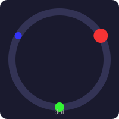

A single point or small cluster of LEDs at a specific angle on the ring.

| Param | Field | Description | Default |
|-------|-------|-------------|---------|
| Angle | `param0` | Position in degrees (0–360), overridden by entity | 0 |
| Spread | `param1` | LEDs lit on each side of center (0 = single LED) | 0 |

**Example: Hour hand dot (red, wide)**
```yaml
- action: esphome.the_circle_configure_layer
  data:
    profile: 0
    strip: 0          # Inner Aura
    layer: 0
    type: 1            # dot
    color_r: 255
    color_g: 0
    color_b: 0
    param0: 0          # angle from entity
    param1: 3          # 3 LEDs each side = 7 LED cluster
    param2: 0
    param3: 0
    entity_id: "sensor.the_circle_clock_hour_angle"
    value_min: 0
    value_max: 360
    intensity: 255
```

---

### 2. Arc (type: 2)

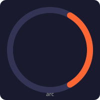

An arc spanning from a start angle to an end angle. Handles wrap-around (e.g. 350°→30°).

| Param | Field | Description | Default |
|-------|-------|-------------|---------|
| Start | `param0` | Start angle in degrees | 0 |
| End | `param1` | End angle in degrees; if HA-bound, end = start + mapped_angle | 0 |

**Example: Fixed orange arc from 1 o'clock to 5 o'clock**
```yaml
- action: esphome.the_circle_configure_layer
  data:
    profile: 0
    strip: 1          # Outer Aura
    layer: 0
    type: 2            # arc
    color_r: 255
    color_g: 102
    color_b: 0
    param0: 30         # start: 30°
    param1: 150        # end: 150°
    param2: 0
    param3: 0
    entity_id: ""
    value_min: 0
    value_max: 360
    intensity: 200
```

---

### 3. Trail (type: 3)

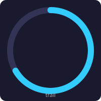

A progress bar from a configurable start angle to an end angle. Supports solid color or gradient between two colors. Handles wrap-around (e.g. 300°→60°).

| Param | Field | Description | Default |
|-------|-------|-------------|---------|
| Start angle | `param0` | Start position in degrees | 0 |
| End angle | `param1` | End position; if HA-bound, end = start + mapped_angle | 0 |
| Color mode | `param2` | 0 = solid (`colors[0]`), 1 = gradient (`colors[0]` → `colors[1]`) | 0 |

When `param2` = 1, set the gradient end color via `set_layer_color` with `color_index: 1`.

**Example 1: Solid dishwasher progress (0–100% → 0°–360°)**
```yaml
- action: esphome.the_circle_configure_layer
  data:
    profile: 5
    strip: 0
    layer: 0
    type: 3            # trail
    color_r: 0
    color_g: 128
    color_b: 255
    param0: 0          # start: 0° (12 o'clock)
    param1: 0          # end: from entity
    param2: 0          # solid mode
    param3: 0
    entity_id: "sensor.lavastoviglie_program_progress"
    value_min: 0
    value_max: 100
    intensity: 255
```

**Example 2: Gradient oven progress (green→red, starting at 6 o'clock)**
```yaml
- action: esphome.the_circle_configure_layer
  data:
    profile: 4
    strip: 0
    layer: 0
    type: 3            # trail
    color_r: 0         # gradient start: green
    color_g: 255
    color_b: 0
    param0: 180        # start: 180° (6 o'clock)
    param1: 0          # end: from entity
    param2: 1          # gradient mode
    param3: 0
    entity_id: "sensor.forno_program_progress"
    value_min: 0
    value_max: 100
    intensity: 255
# Set gradient end color (red)
- action: esphome.the_circle_set_layer_color
  data:
    profile: 4
    strip: 0
    layer: 0
    color_index: 1
    r: 255
    g: 0
    b: 0
```

---

### 4. Solid (type: 4)

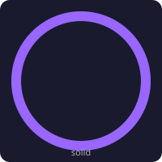

The entire strip filled with a single color. Useful as a background layer.

No angle parameters needed.

**Example: Dim purple background**
```yaml
- action: esphome.the_circle_configure_layer
  data:
    profile: 0
    strip: 2          # Inner Glow
    layer: 0
    type: 4            # solid
    color_r: 80
    color_g: 0
    color_b: 120
    param0: 0
    param1: 0
    param2: 0
    param3: 0
    entity_id: ""
    value_min: 0
    value_max: 100
    intensity: 100
```

---

### 5. Gradient (type: 5)

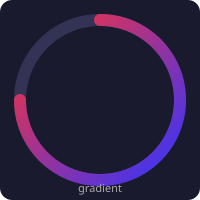

A smooth color transition between two colors across an arc.

| Param | Field | Description | Default |
|-------|-------|-------------|---------|
| Start | `param0` | Start angle | 0 |
| End | `param1` | End angle; if HA-bound, end = start + mapped_angle | 0 |

Uses `colors[0]` for start color and `colors[1]` for end color.

**Example: Red-to-blue gradient across half the ring**
```yaml
- action: esphome.the_circle_configure_layer
  data:
    profile: 0
    strip: 0
    layer: 0
    type: 5            # gradient
    color_r: 255       # start: red
    color_g: 0
    color_b: 0
    param0: 0          # start angle
    param1: 180        # end angle
    param2: 0
    param3: 0
    entity_id: ""
    value_min: 0
    value_max: 360
    intensity: 255
# Set end color (blue)
- action: esphome.the_circle_set_layer_color
  data:
    profile: 0
    strip: 0
    layer: 0
    color_index: 1
    r: 0
    g: 0
    b: 255
```

---

### 6. Segment (type: 6)

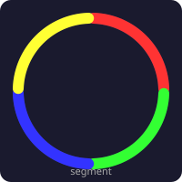

Up to 4 proportional segments filling the strip. Each segment's arc length is proportional to its value relative to the total.

| Param | Field | Description | Default |
|-------|-------|-------------|---------|
| Value 1 | `param0` | Segment 1 value; if HA-bound, overridden by entity | 0 |
| Value 2 | `param1` | Segment 2 value | 0 |
| Value 3 | `param2` | Segment 3 value | 0 |
| Value 4 | `param3` | Segment 4 value | 0 |

Uses `colors[0..3]` for each segment.

**Example: Energy consumption/production/import/export**
```yaml
- action: esphome.the_circle_configure_layer
  data:
    profile: 3
    strip: 0
    layer: 0
    type: 6            # segment
    color_r: 255       # segment 1 (consumption): red
    color_g: 0
    color_b: 0
    param0: 0
    param1: 0
    param2: 0
    param3: 0
    entity_id: "sensor.consumo"
    value_min: 0
    value_max: 10000
    intensity: 255
- action: esphome.the_circle_set_layer_color
  data: { profile: 3, strip: 0, layer: 0, color_index: 1, r: 0, g: 255, b: 0 }     # production: green
- action: esphome.the_circle_set_layer_color
  data: { profile: 3, strip: 0, layer: 0, color_index: 2, r: 0, g: 0, b: 255 }     # import: blue
- action: esphome.the_circle_set_layer_color
  data: { profile: 3, strip: 0, layer: 0, color_index: 3, r: 255, g: 255, b: 0 }   # export: yellow
```

---

### 7. Pulse (type: 7)

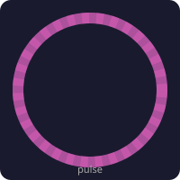

The entire strip breathes (sinusoidal fade in/out) with one color.

| Param | Field | Description | Default |
|-------|-------|-------------|---------|
| Speed | `param0` | Cycles per minute | 30 |
| Min brightness | `param1` | Minimum brightness fraction (0.0–1.0) | 0.1 |
| Max brightness | `param2` | Maximum brightness fraction (0.0–1.0) | 1.0 |

**Example: Slow white breathing on Outer Aura**
```yaml
- action: esphome.the_circle_configure_layer
  data:
    profile: 2
    strip: 1
    layer: 0
    type: 7            # pulse
    color_r: 255
    color_g: 255
    color_b: 255
    param0: 20         # 20 cycles/min (3s period)
    param1: 0.05       # fade to 5%
    param2: 1.0        # up to 100%
    param3: 0
    entity_id: ""
    value_min: 0
    value_max: 100
    intensity: 180
```

---

### 8. Spin (type: 8)

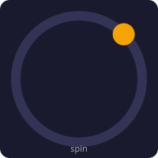

A dot or small cluster that rotates continuously around the ring.

| Param | Field | Description | Default |
|-------|-------|-------------|---------|
| Spread | `param0` | LEDs on each side | 0 |
| Speed | `param1` | Revolutions per minute (RPM) | 10 |
| Direction | `param2` | 0 = clockwise, 1 = counter-clockwise | 0 |

**Example: Orange spinner at 15 RPM**
```yaml
- action: esphome.the_circle_configure_layer
  data:
    profile: 0
    strip: 0
    layer: 3
    type: 8            # spin
    color_r: 255
    color_g: 170
    color_b: 0
    param0: 2          # spread = 2
    param1: 15         # 15 RPM
    param2: 0          # clockwise
    param3: 0
    entity_id: ""
    value_min: 0
    value_max: 100
    intensity: 255
```

---

### 9. Rainbow (type: 9)

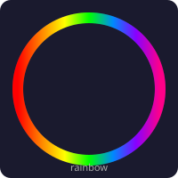

A full-spectrum rainbow distributed across the strip, rotating over time.

| Param | Field | Description | Default |
|-------|-------|-------------|---------|
| Speed | `param0` | RPM of rotation | 5 |

Ignores color settings (uses HSV spectrum). Intensity controls overall brightness.

**Example: Slow rainbow on Inner Glow**
```yaml
- action: esphome.the_circle_configure_layer
  data:
    profile: 1
    strip: 2          # Inner Glow
    layer: 0
    type: 9            # rainbow
    color_r: 255
    color_g: 255
    color_b: 255
    param0: 3          # 3 RPM
    param1: 0
    param2: 0
    param3: 0
    entity_id: ""
    value_min: 0
    value_max: 100
    intensity: 200
```

---

### 10. Strobe (type: 10)

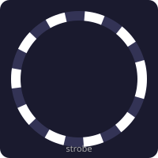

The entire strip flashes on and off at a configurable frequency.

| Param | Field | Description | Default |
|-------|-------|-------------|---------|
| Frequency | `param0` | Flashes per second (Hz) | 2 |
| Duty cycle | `param1` | Fraction of period that is ON (0.0–1.0) | 0.5 |

**Example: Fast white strobe (alert)**
```yaml
- action: esphome.the_circle_configure_layer
  data:
    profile: 7
    strip: 0
    layer: 0
    type: 10           # strobe
    color_r: 255
    color_g: 255
    color_b: 255
    param0: 5          # 5 Hz
    param1: 0.3        # 30% duty (short flashes)
    param2: 0
    param3: 0
    entity_id: ""
    value_min: 0
    value_max: 100
    intensity: 255
```

---

### 11. Sparkle (type: 11)

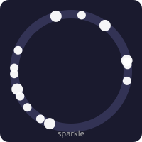

Random LEDs flicker on and off across the strip, creating a twinkling effect.

| Param | Field | Description | Default |
|-------|-------|-------------|---------|
| Density | `param0` | Fraction of LEDs lit at any time (0.0–1.0) | 0.1 |
| Speed | `param1` | Pattern changes per second | 10 |

**Example: Sparse warm white twinkle**
```yaml
- action: esphome.the_circle_configure_layer
  data:
    profile: 0
    strip: 2
    layer: 1
    type: 11           # sparkle
    color_r: 255
    color_g: 200
    color_b: 100
    param0: 0.05       # 5% density
    param1: 8          # 8 changes/sec
    param2: 0
    param3: 0
    entity_id: ""
    value_min: 0
    value_max: 100
    intensity: 200
```

---

### 12. Comet (type: 12)

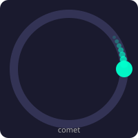

A dot moving around the ring with a fading tail behind it.

| Param | Field | Description | Default |
|-------|-------|-------------|---------|
| Speed | `param0` | RPM | 10 |
| Tail length | `param1` | Number of LEDs in the tail | 20 |
| Direction | `param2` | 0 = CW, 1 = CCW | 0 |

**Example: Cyan comet with long tail**
```yaml
- action: esphome.the_circle_configure_layer
  data:
    profile: 0
    strip: 0
    layer: 0
    type: 12           # comet
    color_r: 0
    color_g: 255
    color_b: 200
    param0: 8          # 8 RPM
    param1: 30         # 30 LED tail
    param2: 0          # clockwise
    param3: 0
    entity_id: ""
    value_min: 0
    value_max: 100
    intensity: 255
```

---

### 13. Threshold (type: 13)

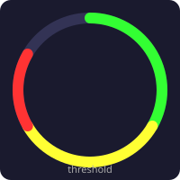

Standalone primitive that changes color based on the bound entity's value crossing two thresholds. Can visualize as solid, trail, or dot.

| Param | Field | Description | Default |
|-------|-------|-------------|---------|
| Mode | `param0` | 0 = solid, 1 = trail, 2 = dot | 0 |
| Spread | `param1` | For dot mode: LEDs on each side | 0 |

Threshold colors are set via `set_threshold` service. Requires HA binding.

**Example: Temperature indicator — green/yellow/red**
```yaml
- action: esphome.the_circle_configure_layer
  data:
    profile: 6
    strip: 1
    layer: 0
    type: 13           # threshold
    color_r: 0
    color_g: 0
    color_b: 0
    param0: 1          # trail mode
    param1: 0
    param2: 0
    param3: 0
    entity_id: "sensor.temperature_salon"
    value_min: 15
    value_max: 35
    intensity: 200
- action: esphome.the_circle_set_threshold
  data:
    profile: 6
    strip: 1
    layer: 0
    enabled: 1
    threshold1: 20     # below 20°C → green
    threshold2: 28     # above 28°C → red
    r0: 0
    g0: 255
    b0: 0
    r1: 255
    g1: 255
    b1: 0
    r2: 255
    g2: 0
    b2: 0
```

### Threshold Modifier

Any visual primitive (1–13) can also have a threshold modifier enabled via `set_threshold`. This overrides the primitive's color based on the bound entity value without changing the primitive type.

---

## Control Primitives (14–17)

Control primitives are **non-visual** and operate at **profile level** (not per-strip). They gate or trigger behavior for the entire profile. Each profile has 4 control layer slots.

| Slot | Type | ID | Function |
|------|------|----|----------|
| 0 | Buzzer | 14 | Plays sound when HA entity triggers |
| 1 | Lux Gate | 15 | Blocks profile if ambient light too high |
| 2 | mmWave Gate | 16 | Activates profile on physical presence |
| 3 | HA Presence Gate | 17 | Activates profile on HA presence entity |

**Gate logic:** if ANY gate returns "blocked", all strips render black. Gates are evaluated every frame before rendering.

Control layers are configured via `configure_control_layer` service (not `configure_layer`).

---

### 14. Buzzer (type: 14, slot: 0)

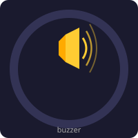

Monitors an HA entity. When the value transitions from off→on (rising edge), plays a preset sound sequence through the piezo buzzer.

| Param | Field | Description | Default |
|-------|-------|-------------|---------|
| Sound preset | `param0` | Preset index (0–5, see table below) | 0 |

| Preset | Name | Description |
|--------|------|-------------|
| 0 | notify | 2 short beeps |
| 1 | alert | 3 ascending tones |
| 2 | alarm | 6 rapid beeps |
| 3 | chime | Ding-dong |
| 4 | success | Ascending scale (C-E-G-C) |
| 5 | error | Descending scale |

Requires `entity_id` binding. Triggers once per rising edge (re-triggers when entity goes off→on again).

**Example: Chime when oven finishes**
```yaml
- action: esphome.the_circle_configure_control_layer
  data:
    profile: 4
    slot: 0            # buzzer slot
    type: 14           # buzzer
    param0: 3          # preset: chime
    entity_id: "binary_sensor.forno_finito"
```

---

### 15. Lux Gate (type: 15, slot: 1)

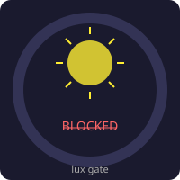

Reads the BH1750 ambient light sensor directly. If lux exceeds the threshold, the profile is blocked (all LEDs off). Useful to disable LEDs during daytime.

| Param | Field | Description | Default |
|-------|-------|-------------|---------|
| Lux threshold | `param0` | Maximum lux before blocking | 500 |

No HA binding needed — reads from local BH1750 sensor.

**Example: Disable profile if room brightness > 300 lux**
```yaml
- action: esphome.the_circle_configure_control_layer
  data:
    profile: 1
    slot: 1            # lux gate slot
    type: 15           # lux_gate
    param0: 300        # threshold: 300 lux
    entity_id: ""
```

---

### 16. mmWave Gate (type: 16, slot: 2)

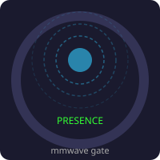

Reads the LD2410 detection distance directly. Activates the profile only when someone is detected within the configured maximum distance. When no one is present, the profile is blocked (LEDs off).

| Param | Field | Description | Default |
|-------|-------|-------------|---------|
| Max distance | `param0` | Maximum detection distance in cm | 400 |

No HA binding needed — reads from local LD2410 sensor. A distance of 0 means no target detected.

**Example: Show clock only when someone is within 2 meters**
```yaml
- action: esphome.the_circle_configure_control_layer
  data:
    profile: 1
    slot: 2            # mmwave gate slot
    type: 16           # mmwave_gate
    param0: 200        # max 200 cm
    entity_id: ""
```

---

### 17. HA Presence Gate (type: 17, slot: 3)

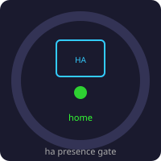

Like mmWave Gate but driven by a Home Assistant entity. Useful for room occupancy sensors, person trackers, or any binary/presence entity.

No custom parameters — the gate is open when the entity value ≥ 0.5 (on/home/true) and closed when < 0.5 (off/not_home/false).

String states are automatically mapped: `home`→1, `not_home`→0, `on`→1, `off`→0, etc.

**Example: Show profile only when room is occupied**
```yaml
- action: esphome.the_circle_configure_control_layer
  data:
    profile: 1
    slot: 3            # ha presence gate slot
    type: 17           # ha_presence_gate
    param0: 0
    entity_id: "binary_sensor.occupazione_pranzo"
```

---

## HA Services

### Visual Layer Services

| Service | Description | Key params |
|---------|-------------|------------|
| `configure_layer` | Create/configure a visual primitive | `profile, strip, layer, type, color_r/g/b, param0-3, entity_id, value_min/max, intensity` |
| `set_layer_color` | Set color slot 0–3 | `profile, strip, layer, color_index, r, g, b` |
| `set_threshold` | Configure threshold modifier | `profile, strip, layer, enabled, threshold1/2, r0-2/g0-2/b0-2` |
| `bind_entity` | Bind/rebind HA entity to layer | `profile, strip, layer, entity_id, value_min/max` |
| `clear_layer` | Remove a visual layer | `profile, strip, layer` |

### Control Layer Services

| Service | Description | Key params |
|---------|-------------|------------|
| `configure_control_layer` | Configure a control primitive | `profile, slot (0-3), type (14-17), param0, entity_id` |
| `clear_control_layer` | Remove a control layer | `profile, slot` |

### Profile Services

| Service | Description | Key params |
|---------|-------------|------------|
| `set_profile` | Switch active profile | `profile_index` |
| `next_profile` | Cycle to next profile (wraps) | — |
| `prev_profile` | Cycle to previous profile (wraps) | — |
| `rename_profile` | Set profile name | `profile, name` |
| `save_profiles` | Persist all profiles to flash | — |

### JSON Export Services

| Service | Description | Key params |
|---------|-------------|------------|
| `get_profile_config` | Export profile config as JSON | `profile` |
| `refresh_profiles_list` | Refresh profiles overview | — |

---

## Touch Controls

| Touch Pad | Action |
|-----------|--------|
| Left | Previous profile (cycles 1→10→1) |
| Right | Next profile (cycles 10→1→10) |
| OK | (Available for custom binding) |
| Esc | (Available for custom binding) |

---

## YAML Configuration

```yaml
the_circle:
  id: circle
  strips:
    - light_id: i_a        # Strip 0: Inner Aura
    - light_id: o_a        # Strip 1: Outer Aura
    - light_id: i_g        # Strip 2: Inner Glow
  num_profiles: 10
  layers_per_strip: 6
  # Local sensor references for control primitives
  lux_sensor_id: illuminance          # BH1750 sensor id
  presence_distance_id: detection_distance  # LD2410 sensor id
  buzzer_id: buzzer_output            # LEDC output id
```

See `the-circle.yaml` for the complete configuration including UI entities (select, number, text).

---

## HA Package

The file `ha_package_the_circle.yaml` provides:

- **Template sensors** for clock angles (hour/min/sec → 0°–360°)
- **Preset scripts** for 6 pre-configured profiles (off, clock, clock+pulse, energy, oven, dishwasher)
- **Master script** `the_circle_setup_all_presets` to configure all presets and save to flash

Copy to `config/packages/the_circle.yaml`.

---

## JSON Export Sensors

Two text sensors export the current configuration for external tools (custom cards):

- `sensor.the_circle_profiles_list` — updated on boot, profile switch, rename:
  ```json
  {"active":0,"count":10,"leds":[263,132,111],"profiles":[{"i":0,"n":"Clock"},{"i":1,"n":"Energy"},...]}
  ```

- `sensor.the_circle_profile_config` — on-demand via `get_profile_config` service:
  ```json
  {"p":0,"n":"Clock","s":[{"i":0,"l":[{"i":0,"t":1,"c":[[255,0,0],...],"p":[0,3,0,...],"int":255,"eid":"sensor.x","vn":0,"vx":360,"hv":45.0,"th":{"on":0}}]}]}
  ```

---

## File Structure

```
the-circle/
├── README.md                               # This file
├── README.it.md                            # Italian documentation
├── the-circle.yaml                         # ESPHome config example
├── ha_package_the_circle.yaml              # HA package (templates + presets)
├── hacs.json                               # HACS metadata
├── images/                                 # Primitive illustrations
├── translations/                           # Entity labels (en/it/fr/es/de)
└── components/the_circle/
    ├── __init__.py                          # Component registration + codegen
    ├── select.py                            # Select entity platform
    ├── number.py                            # Number entity platform
    ├── text.py                              # Text entity platform
    ├── text_sensor.py                       # JSON export sensors
    ├── primitive.h                          # 17 primitive types
    ├── profile.h                            # Profile (6 visual + 4 control layers)
    ├── renderer.h                           # Painter's algorithm compositor
    ├── storage.h                            # Flash persistence (NVS)
    ├── ui_entities.h / .cpp                 # Web UI entity classes
    └── the_circle.h                         # Main component
```

---

## License

MIT
